#BOTSv3

Suspicious activity was detected from internal host `192.168.3.130` which repeatedly contacted external server `54.67.127.227` indicating command-and-control beaconing and possible data exfiltration. Unusual AWS activity and heavy command execution on endpoint BSTOLL-L also suggest the system was compromised.

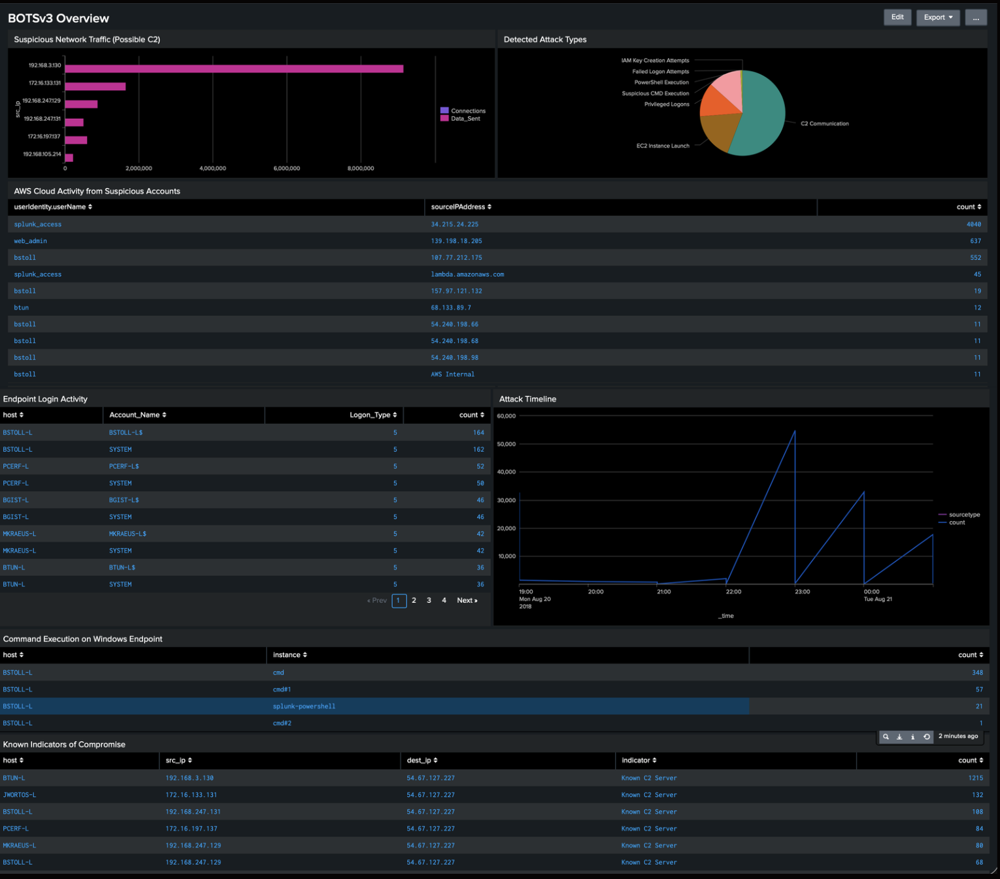

> For this project, I used Splunk searches across network (stream:http), cloud (aws:cloudtrail), and endpoint (PerfmonMk:Process) logs to identify the traffic patterns, review cloud access, and confirm suspicious process activity.

##  Investigation Using SPL

**Step 1: Initial C2 Detection**
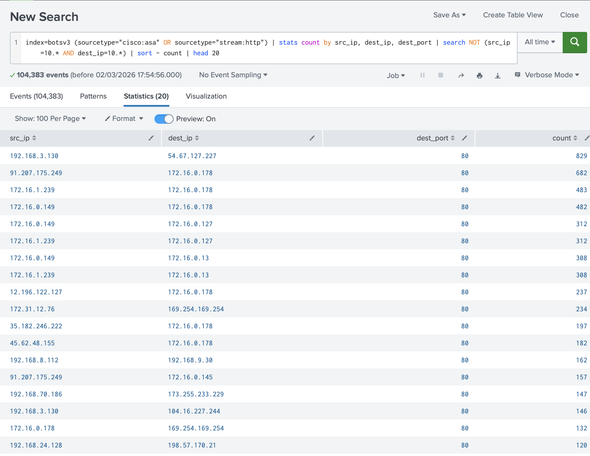

Host `192.168.3.130` showed 983 connections to `54.67.127.227` on port `80`. This volume of traffic to a single external destination is atypical and suggests
C2 communication or data exfiltration.

---

**Step 2: Timeline Analysis**
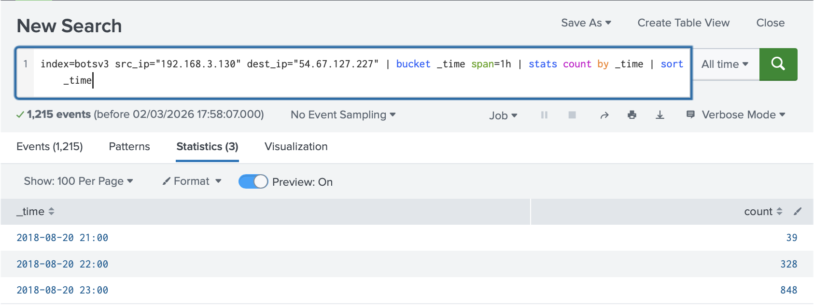
Connections escalated from 39 to 328 then 848 within 2 hours showing a clear automated beaconing pattern

---

**Step 3: Destination Analysis**
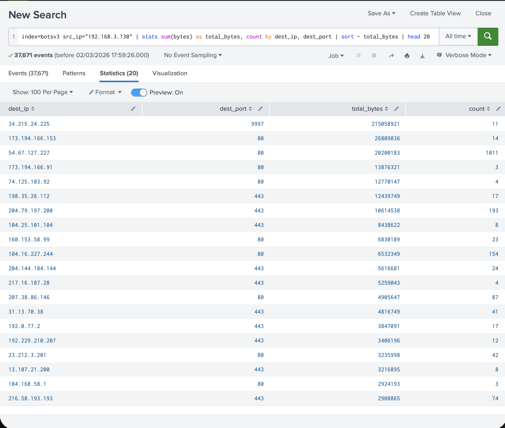

Host `192.168.3.130` sent large outbound traffic, including high-volume transfers to `34.215.24.225:9997` repeated connections to `54.67.127.227` and significant data sent to multiple Google IPs.
Command-and-control activity with likely data exfiltration disguised as normal web traffic.

---

**Step 4: URI Pattern Analysis**
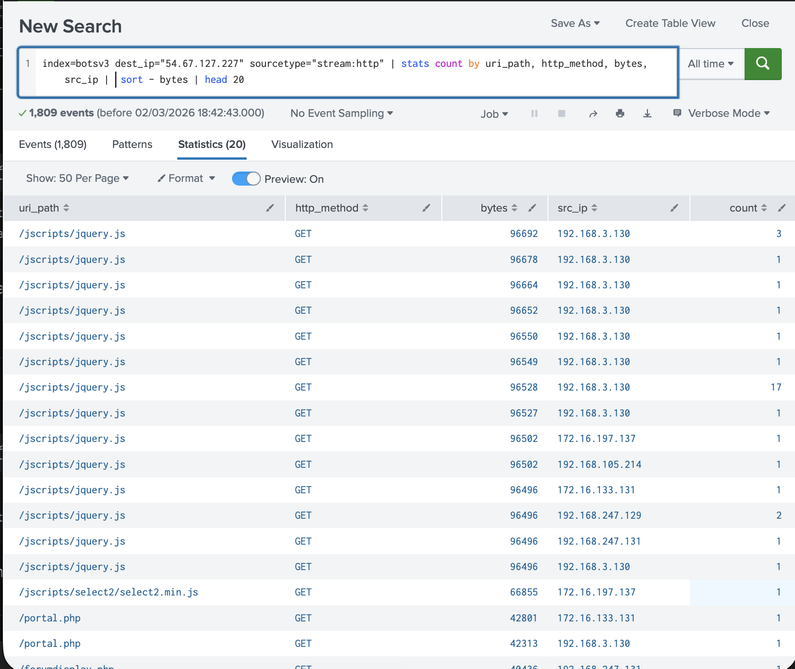
Repeated `/jscripts/jquery.js` requests with nearly identical byte sizes from multiple hosts indicate automated beaconing with structured payload delivery to C2.

---

 **Step 5: Outbound Data Pattern Identified**
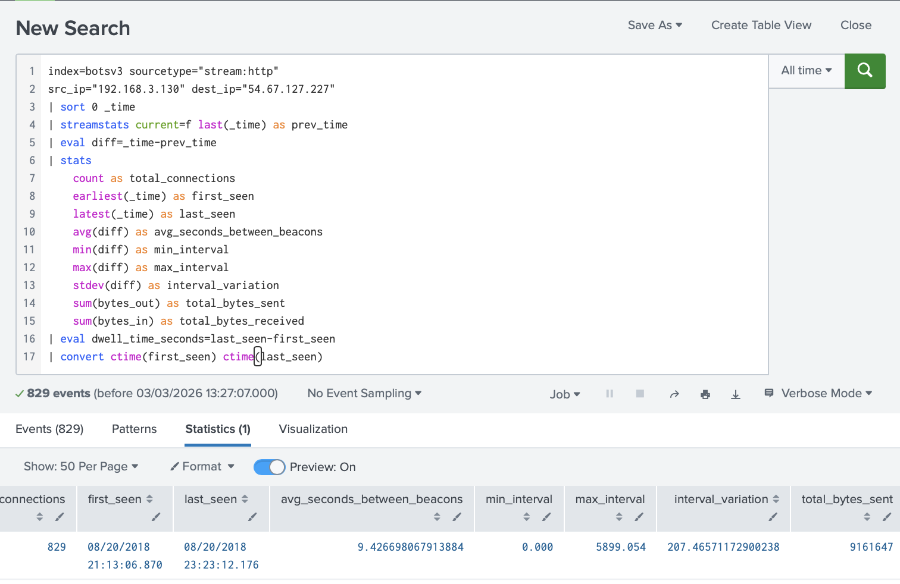
The host kept regularly connecting to the external server for a long period, showing clear automated communication. Much more data was sent out than received

---

**Step 6: AWS CloudTrail Overview**
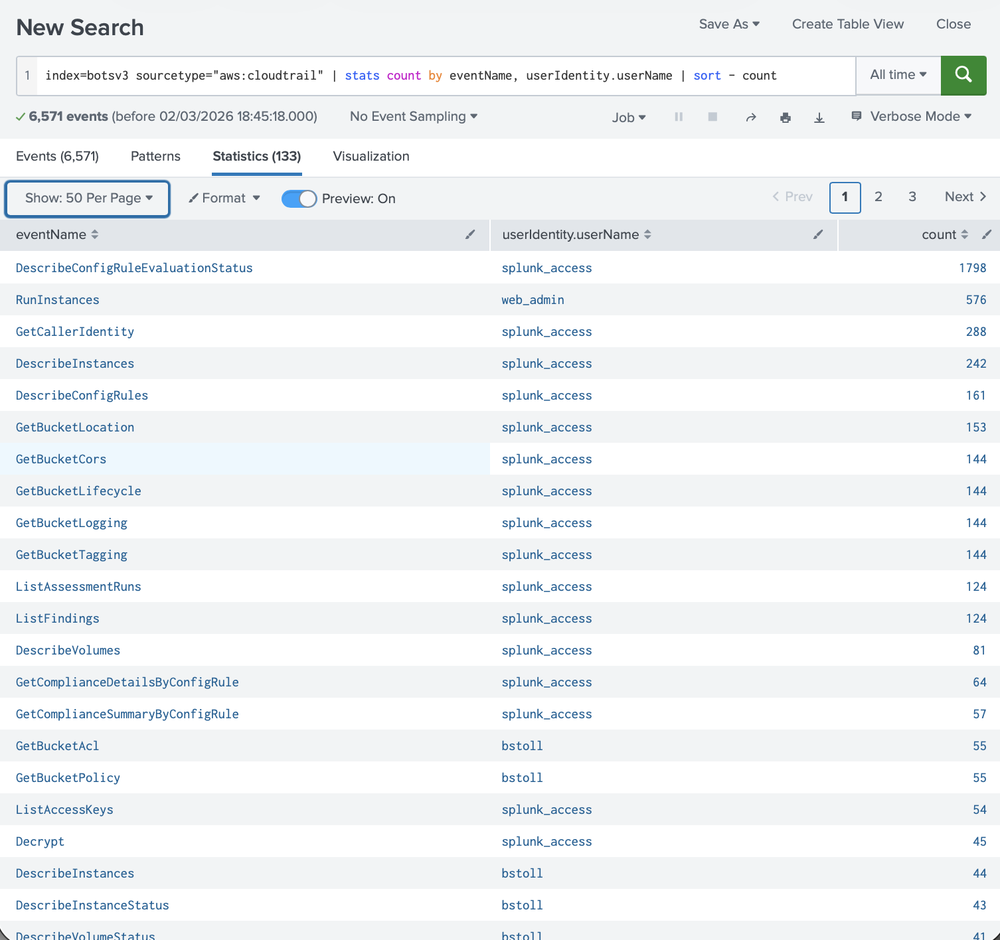
Large numbers of RunInstances actions by web_admin and many environment checks by splunk_access suggest the attacker was creating cloud instances and exploring the AWS environment after gaining access

---

 **Step 7: AWS Login Detected**
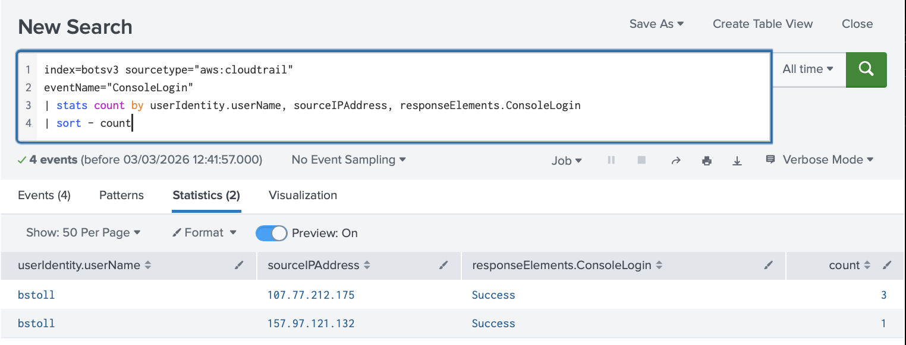
CloudTrail logs show user bstoll logged into the AWS console from two public IP addresses. This suggests the account credentials were likely compromised and used for remote access

---

 **Step 8: Cloud Environment Reviewed**
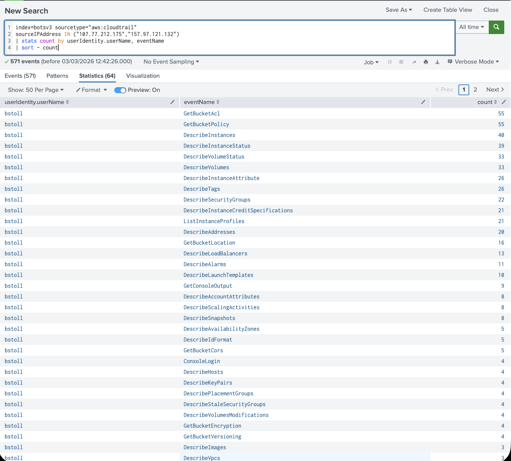
After logging in, bstoll made 571 AWS API calls, mostly viewing S3, EC2, IAM, and account settings. This shows the attacker was exploring and reviewing the cloud setup

---

**Step 9: Access Key Creation Attempt**
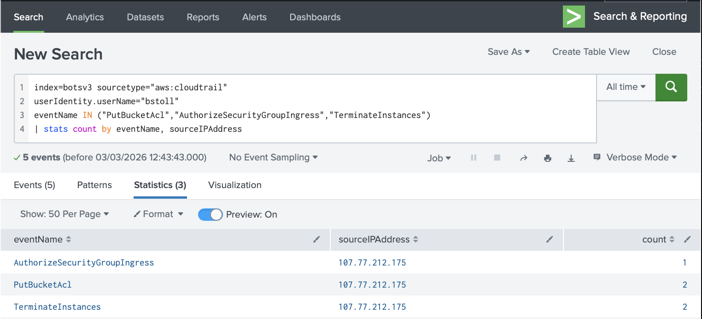
An external IP `35.153.154.221` tried to create a new access key for web_admin using the AWS API. This is a common method attackers use to keep long-term access.

---

**Step 10: C2 Beaconing Interval Analysis**

829 connections from 192.168.3.130 to 54.67.127.227 shows a consistent beaconing pattern between the host and the external server, indicating automated command-and-control communication. The host sent significantly more data than it received

---

**Step 11: Suspicious Process Execution on Endpoint**

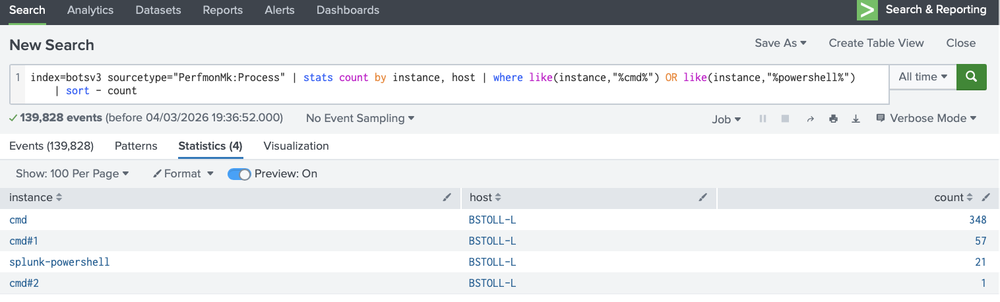

Host BSTOLL-L generated 406 cmd.exe executions and 21 PowerShell processes, indicating heavy command activity. Multiple concurrent command shells suggest automated scripts or attacker commands. This endpoint activity aligns with the C2 traffic from `192.168.3.130`, confirming it as the likely compromised system.

## Recommended Implementations

| Priority | What to Monitor | Example Log Source | Simple Trigger | Suggested Action |
|----------|----------------|-------------------|---------------|-----------------|
| Critical | C2 traffic | stream:http | Large number of connections to the same external IP | Block the IP and isolate the affected host |
| Critical | Data leaving the network | stream:http | Large outbound traffic (e.g. >10MB) | Investigate host and stop the transfer |
| Critical | Suspicious AWS activity | aws:cloudtrail | New instances or access keys created unexpectedly | Disable the account and review IAM permissions |
| High | Unusual command execution | PerfmonMk:Process | Many cmd.exe or PowerShell executions | Investigate endpoint for compromise |
| High | Multiple internal logins | WinEventLog:Security (4624) | Logins across multiple systems in short time | Check for lateral movement |
| High | Failed login attempts | WinEventLog:Security (4625) | Many failed logins in a short period | Block source IP and review account security |
| Medium | Unusual outbound destinations | Network logs | Internal host communicating with rare external IPs | Review traffic and block if malicious |
| Medium | Cloud account protection | AWS IAM / CloudTrail | Logins from unfamiliar public IPs | Enable MFA and rotate credentials |
| Medium | Endpoint protection | EDR / Sysmon | Suspicious process creation or persistence attempts | Run endpoint scan and remove malware |
